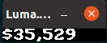

# crypto_ticker

Simple Crypto Ticker with a sense of Humor.

This uses the Luma Library to display to a MAX7219 display that would be connected to a Raspberry PI

## Config

Configuration is done in the config.yaml file.

Select as many cryptos as you'd like in the config.yaml. Only one vs_currency is supported, and it only shows in $'s right now. So really it's just usd. 

The selected IDs need to existin in the [Coingeck API](https://api.coingecko.com/api/v3/coins/list).

Then each one will be added to a list and scroll across the screen. 

## Usage

Once your MAX7219 is connected to your raspberry PI with an internet connection, run main.

```bash
pip install -r requirements.txt
python3 main.py
```

There are different modes for ways to display the information.

### Console

Displays display methods calls in the console. This is useful for headless environments which don't have a way to display the information other than the console.

```bash
MODE=CONSOLE python3 main.py
```

Example output:

```
⟩ MODE=CONSOLE python3 main.py
{'ticker': {'crypto': 'bitcoin', 'vs_currency': 'usd', 'tell_jokes': True}}
show_message(message=BTC: $34,276 DOGE: $0.234215 , fill=white, font=proportional, scroll_delay=0.04)
show_meshow_message(message=BTC: $34,276 DOGE: $0.234215 , fill=white, font=proportional, scroll_delay=0.04)
show_message(message=BTC: $34,276 DOGE: $0.234216 , fill=white, font=proportional, scroll_delay=0.04)
ssage(message=How come the stadium got hot after the game?.....Because all of the fans left., fill=white, font=proportional, scroll_delay=0.04)

```

### Pygame

Displays information in a Pygame Emulator.

This is useful for when you are in an environment other than a raspberry pi and you do not have a SPI/MAX7219 physical device.

```bash
MODE=PYGAME python3 main.py
```
Here is a screenshot of window with pygame emulator running



